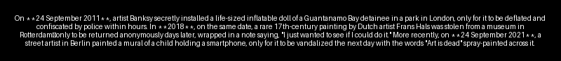

# 🎯 Mistrallnecdote

A GitHub Action that generates daily historical anecdotes using Mistral AI and converts them into beautiful images. The action picks a random topic from a configurable list and creates engaging visual stories in multiple languages.

## ✨ Features

- 🤖 Generates interesting anecdotes using Mistral AI
- 🌍 Supports multiple languages (English, French, Spanish, German)
- 🎨 Creates visually appealing images with generated text
- 📚 Supports multiple topics (History, Technology, Science, Art, etc.)
- ⚙️ Highly configurable through action inputs
- 🔄 Daily automated generation through GitHub Actions
- 🎯 Text-to-image conversion with centered formatting

## 🚀 Usage

To use this action, you'll need to:

1. Set up the required permissions in your workflow
2. Add the action configuration

### Required Permissions

Make sure to add the following permissions to your workflow to allow the action to write files:

```yaml
permissions:
  contents: write  # Required to write the generated image file
```

### Workflow Example

Add this GitHub Action to your workflow:

```yaml
name: Daily Anecdote
on:
  schedule:
    - cron: '0 0 * * *'  # Runs daily at midnight
  workflow_dispatch:      # Allows manual trigger

permissions:
  contents: write  # Required to write the generated image file

jobs:
  generate:
    runs-on: ubuntu-latest
    steps:
      - uses: tot0p/Mistrallnecdote@v1.0.0
        with:
          mistral_api_key: ${{ secrets.MISTRAL_API_KEY }}
          OUTPUT_PATH: "anecdotes/daily.png"
          topics: "History, Technology, Science, Art"
          language: "en"
```

### Example Output

Here's an example of a generated anecdote image:



## ⚙️ Configuration

| Input | Description | Default |
|-------|-------------|---------|
| `mistral_api_key` | Your Mistral AI API key | Required |
| `OUTPUT_PATH` | Path for the generated image | output_image.png |
| `topics` | Comma-separated list of topics | History, Computers, Science, Technology, Art, Music, Literature, Sports, Nature, Food, Duck |
| `model` | Mistral AI model to use | mistral-small-latest |
| `temperature` | Generation temperature (0.0-1.0) | 0.7 |
| `max_length` | Maximum token length | 1000 |
| `language` | Language for generated anecdotes | en |

### Supported Languages

- 🇬🇧 English (en)
- 🇫🇷 French (fr)
- 🇪🇸 Spanish (es)
- 🇩🇪 German (de)
- Other languages supported by Mistral AI

## 💻 Local Development

1. Clone the repository
2. Install dependencies:
```bash
pip install -r src/requirements.txt
```

3. Set up environment variables:
```bash
export MISTRAL_API_KEY="your-api-key"
export TOPICS="History, Science, Technology"
export MODEL="mistral-small-latest"
export TEMPERATURE="0.7"
export MAX_TOKENS="1000"
export OUTPUT_PATH="output_image.png"
export LANGUAGE="en" 
```

4. Run the script:
```bash
python src/main.py
```

## 📝 Requirements

- Python 3.x
- Pillow (Python Imaging Library)
- requests


## 📄 License

This project is licensed under the MIT License - see the [LICENSE](LICENSE) file for details.

## 👤 Author

**Thomas Lemaitre** (tot0p)

## 🤝 Contributing

Contributions, issues, and feature requests are welcome! Feel free to check the [issues page](https://github.com/tot0p/Mistrallnecdote/issues).